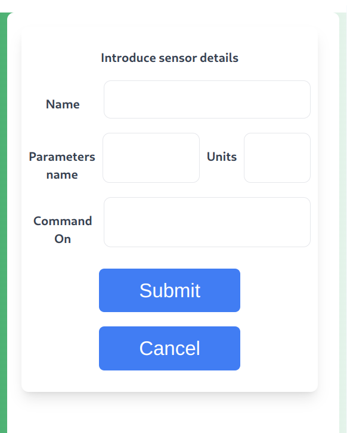
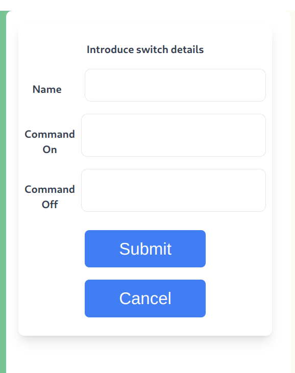

<!-- omit in toc -->
# iHome

<font color="#356CF3">**NOTE:**</font>


This is a MVP version, altough it's still work in progress - it can be already used.

<br>

<!-- omit in toc -->
## Table of Contents
- [Description](#description)
- [Installation](#installation)
  - [Server-side application to install on RaspberryPi](#server-side-application-to-install-on-raspberrypi)
    - [Instalation prerequirements](#instalation-prerequirements)
    - [Predefined main scripts](#predefined-main-scripts)
  - [Client-side application](#client-side-application)
- [Run all with Docker](#run-all-with-docker)
- [Application usage](#application-usage)
  - [Sensor registration](#sensor-registration)
  - [Switch installation](#switch-installation)

# Description
This project aims to optimze home energy consumption. It's a client-server application which manages devices connected to the Raspberry Pi.
The main design concept is to enable users to control connected devices using a language of their choice.
Applications allows data persistence in MongoDB (ie. MongoDB Atlas) or files.
<br>

# Installation

To use the library clone the repository and install all dependencies.

```bash
git clone https://github.com/konrad-winnicki/iHome
```


## Server-side application to install on RaspberryPi
### Instalation prerequirements
To use server-side application first Node.js >= 18.18 version should be installed. Then you can follow the steps:

- install all dependencies:
```bash
npm install
```

- build app and generate javascript code:
```bash
npm build
```
- run app in a production mode:
  
```bash
npm run prod
```

During running the app in the production mode, user will be asked to choose:
- port (default: 4000, if changed you need to modify port value in client config.ts file and generate new APK for android)
- place of data persistence (if database is chosen, in the next step a connection string with password to MongoDB Atlas should be provided)
- password to pair client and server

### Predefined main scripts 

`package.json` in the server directory `./server` contains several predefined scripts which can be run with `npm run` and:</br>
```build``` : to transpile `TypeScript` to `JavaScript` </br>
```prod``` : to start the backend server in the production mode </br>
```nodemon_database``` : to start nodemon and server in development mode using Mongo persistence</br>
```nodemon_file``` : to start nodemon and server in development mode using file persistence </br>
```dev_database``` : to start server in development mode using Mongo persistence</br>
```dev_file``` : to start server in development mode using file persistence </br>
```test_domain``` : to start domain tests</br>
```test_infrastructure``` : to start infrastructure tests</br>
```test_api_database``` or ```test_api_file``` : to start integration api tests</br>
```test_all_file``` or ```test_all_database``` : to start integration api tests</br>


## Client-side application
Client side app can be run:
1. as a browser application. 
- install all dependencies:
```bash
npm install
```
- build react app:
```bash
npm build
```
- run app:
```bash
npm run dev
```
Now you can use `iHouse` client interface by going to:
http://localhost:5173/login

2. as an Android App:
- download APK file and install on SmartPhone


# Run all with Docker
The `Dockerfile_backend` and `Dockerfile_frontend` contain set of instructions and configurations to build a docker container images for frontend and backend.
The `docker-compose.yaml` file specifies the services for backend, frontend and mongodb.
To start all components using docker just type in the project root directory:

```bash
docker-compose --env-file=.env.database up -d
```
or
```bash
docker-compose --env-file=.env.file up -d
```
depending on whether you want a database or file based persistence.

To stop all docker containers:
```bash
docker-compose down 
```

# Application usage
## Sensor registration

<p align="center">
  
</p>

- indicate sensor name to be shown in app
- parameters name (separated by comma, without spaces)
- parameter units (separated by comma, without spaces)
- command to run script (e.g. python3.9 /home/pi/sensor.py on)

<font color="#356CF3">**IMPORTANT:**</font>
 In case of sensors, after sensor script is run the application is waiting for its stdout.
 Thus, sensor scripts should return result in a JSON format sending it to the standard output (stdout).
 The JSON must contain parameters defined during sensor registration together with their corresponding values collected by sensor e.g: 
```json
{
  "temperature": "25",
  "humidity": "45"
}
```

## Switch installation

<p align="center">
  
</p>

- indicate switch name to be shown in app
- command to run switch on script (e.g. python3.9 /home/pi/switch.py on)
- command to run switch off script (e.g. python3.9 /home/pi/switch.py off)


